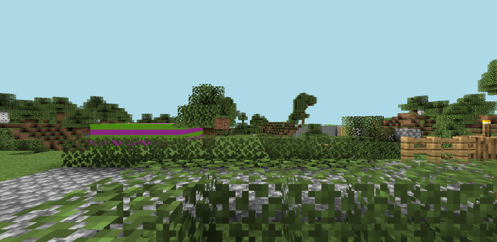

# Installation Guide for MineSpy
This is a guide to explain the easiest way to install MineSpy for your server.

## Required Reading
You will need the following:
- A spare Java login for your server, password must be included if [``online_mode``](https://minecraft.gamepedia.com/Server.properties) is enabled.
- A computer/VPS/server with [NodeJS](https://nodejs.org/en/) installed on it.
- Around 10 to 15 minutes

## Getting Started
Download the latest release by going to the [homepage of the repo](https://github.com/normanlol/minespy) and clicking the "Code" button 
and choose your preferred method.

If you are unsure what you are doing, just click "Download ZIP".

Once downloaded (and extracted, if you chose to download the ZIP file), open a terminal in the directory of MineSpy and run the command ``npm i``

Then, create a copy of the ``config.example.json`` in MineSpy and name it ``config.json``.

## Configuration
This is what the ``config.json`` file should currently look like.

```json
{
    "serverHost": "some.cool.ip.here",
    "serverPort": 8000,
    "imageServerPort": 8010,
    "firstPerson": true,
    "mcUsername": "someUserName",
    "mcPassword": "P@ssw0rdH3re"
}
```

You should tweak this to your needs, like so.

```json
{
    "serverHost": "[YOUR MINECRAFT SERVER IP WITHOUT PORT]",
    "serverPort": 9029,
    "imageServerPort": 8005,
    "firstPerson": true,
    "mcUsername": "[JAVA ACCOUNT EMAIL]",
    "mcPassword": "[JAVA ACCOUNT PASSWORD]"
}
```
Don't use this as your personal configuration. Be sure to also tweak the ``serverPort`` thing to your own server port. If it is just a domain, use ``25565``. Don't change the ``imageServerPort`` or ``firstPerson`` values just yet.

An example of splitting it up properly is this, if your server is ``mc.domain.co:6585`` you would set ``serverHost`` as ``mc.domain.co`` and ``serverPort`` as ``6585``. Simple!

## Running for the first time
Open a terminal once more in the MineSpy directory and run the command ``node .``. This *should* start outputting in the terminal something similar to this: 

```
-- minespy starting --
-- conecting to [server ip]:[server port] --
-- logged in and spawned --
Prismarine viewer web server running on *:8005
```

Check this by going to [localhost:8005](http://localhost:8005) and seeing for yourself.



*Here is an example of a spawn for my server.*

If it looks like your Minecraft spawn within a few seconds then, congrats!

## Further Configuration
You can also change the port of the URL (``imageServerPort``) to see your server to any port you wish, along with changing the point of view by setting ``firstPerson`` to either ``true`` (default) or ``false``